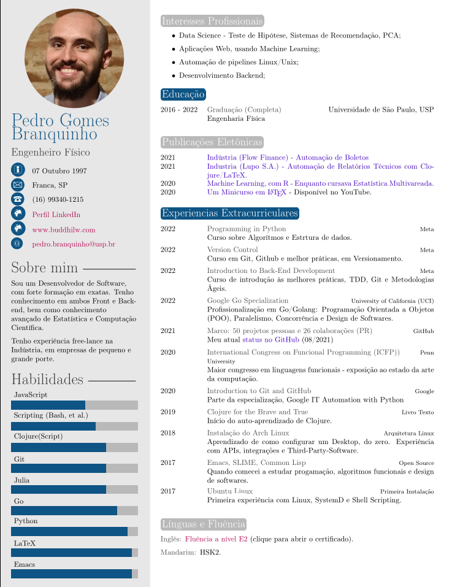

# Curriculum Vitae

The main files are under `tex`, the `cls` is the class style for the document. And, the images that populate the document are under `img`.

# Portuguese and English versions
There are `cls` files for both the portuguese and english versions of the CV. Mostly, the differences are on hyphenation and line-break; style was keept equal, as much as possible.

# Outputs
The outputs are kept under `out`, where should be only _pdf_ files.

Results:

<!--  -->

